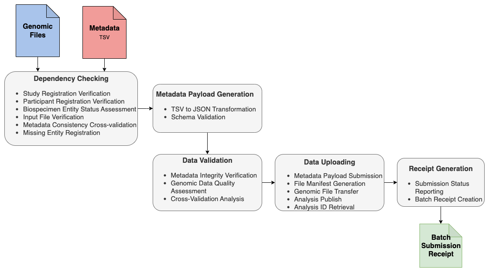

# PCGL Molecular Data Submission Workflow: Introduction

---

## Overview

The Pan-Canadian Genome Library (PCGL) [Molecular Data Submission Workflow](https://github.com/Pan-Canadian-Genome-Library/molecular-data-submission-workflow) is a Nextflow-based pipeline that **simplifies and automates** the submission of molecular genomics data to the PCGL repository. The workflow has adopted [nf-core](https://nf-co.re/) framework and best practice guidelines to ensure reproducibility, portability and scalability.

### What This Workflow Does For You

✅ **Validates your data** before submission to catch errors early  
✅ **Automates complex submission steps** reducing manual work from days to hours  
✅ **Ensures compliance** with PCGL data model and requirements  
✅ **Provides clear feedback** with detailed reports on success/failure status  
✅ **Handles large-scale submissions** efficiently with batch and parallel processing  
✅ **Maintains audit trails** for regulatory compliance and tracking  

### Supported Data Types

This workflow supports submission of:
- **Genomic Data**: WGS, WES, RNA-Seq, Panel sequencing
- **File Formats**: CRAM, BAM, VCF, BCF (with corresponding index files)
- **Analysis Types**: Variant calling, Alignment, Raw Sequencing Reads
- **Metadata**: Biospecimen and Analysis Entities 

### What to Expect

**Terminal Output Behavior:**
- **Parameter Display**: Workflow begins by showing all input parameters and configuration settings
- **Real-time Process Execution**: Live updates as each pipeline process runs, with progress indicators
- **Process Status**: Clear indication of which step is currently executing (e.g., validation, upload, receipt generation)
- **Completion Summary**: Successful runs conclude with a comprehensive summary of submitted analyses
- **Early Termination**: Critical issues trigger immediate workflow termination with clear error messages

**Processing Characteristics:**
- **Parallel Processing**: Multiple samples are processed simultaneously for efficiency
- **Fault Tolerance**: Individual sample failures don't stop the entire batch
- **Resource Scaling**: Performance varies based on system resources and data size

**Timing Expectations:**
- **Parallel Processing**: Most workflow processes run in parallel across samples, significantly reducing overall submission time
- **Variable Completion Times**: Duration depends on multiple factors:
  - **File sizes**: Larger genomic files take longer to process and upload
  - **Parallel resources**: Number of concurrent jobs affects speed across all workflow stages
  - **Network throughput**: Available bandwidth impacts transfer rates
  - **System resources**: CPU, memory, and storage I/O capabilities affect all processing steps
- **Small batches (1-10 samples)**: Minutes to hours depending on factors above
- **Large batches (100+ samples)**: Hours to days depending on factors above

---

## Prerequisites

**PCGL Registration Requirements:**
- [ ] Study registered in PCGL *(Contact: helpdesk@genomelibrary.ca)*
- [ ] All participants registered *(Coordinate with your Study data coordinator)*
- [ ] API token obtained *(Request from PCGL administrator)*
- [ ] Data files ready and accessible *(See [Input Documentation](Input.md))*
- [ ] Metadata prepared in required format *(Templates URLs to be added)*

**System Requirements:**
- [ ] **Nextflow**: v22.04.0+ (DSL2)
- [ ] **Container Engine**: Docker (recommended), Singularity/Apptainer, or Conda
- [ ] **Java**: 17 or newer
- [ ] **Bash**: 3.2 or newer
- [ ] **Memory**: 8GB RAM minimum (16GB+ recommended for large batches)
- [ ] **Storage**: 2-3x the size of your input data for intermediate files

**Network Requirements:**
- [ ] Internet connectivity to PCGL services
- [ ] Outbound HTTPS access to PCGL services
- [ ] Firewall rules for PCGL API endpoints *(if in institutional environment)*
- [ ] Sufficient bandwidth for large file uploads

**User Skills:**
- [ ] Basic command-line familiarity
- [ ] Understanding of genomic file formats (CRAM, BAM, VCF, BCF)

---

## Getting Started

### New to PCGL? Start Here

1. **Contact PCGL Team**: Email helpdesk@genomelibrary.ca to begin registration
2. **Complete Study Registration**: Ensure your study is registered in PCGL
3. **Register Participants**: All study participants must be registered before data submission
4. **Obtain API Token**: Request submission credentials from your PCGL data coordinator

### Ready to Submit? Quick Start

🚀 **Follow these steps to submit your data successfully:**

1. **📋 Prepare Your Data**
   - Organize files according to [Input Requirements](Input.md)
   - Validate metadata files match required formats
   - Ensure all data files are accessible and properly named

2. **⚙️ Set Up Your Environment**
   - Follow the [Environment Setup](#environment-setup) guide below
   - Install required software and configure API access
   - Verify your setup works correctly

3. **🧪 Test First**
   - Run the [Testing Guide](testing.md) with provided test dataset
   - Confirm workflow executes successfully in your environment
   - Familiarize yourself with the process using safe test data

4. **📤 Submit Real Data**
   - Start with a **small batch (1-2 samples)** following [Usage Guide](usage.md)
   - Monitor the submission process and verify success
   - Scale up to larger batches once comfortable with the workflow

5. **📊 Review Results**
   - Understand your outputs using [Output Documentation](output.md)
   - Interpret submission status with [Receipt Guide](Receipt.md)
   - Keep receipts for audit trails and future reference

> 💡 **Pro Tip**: Always test with a small batch before submitting large datasets. This helps identify any issues early and ensures you understand the process.

---

## Environment Setup

### Step 1: Install Nextflow

```bash
# Install Nextflow
curl -s https://get.nextflow.io | bash
chmod +x nextflow
sudo mv nextflow /usr/local/bin/

# Verify installation
nextflow info
```

> 💡 **Tip**: See the [Nextflow installation guide](https://www.nextflow.io/docs/latest/install.html) for detailed instructions and troubleshooting.

### Step 2: Install Container Engine

**Option A: Docker (Recommended)**
```bash
# Follow Docker installation guide for your platform
# https://docs.docker.com/get-docker/

# Verify installation
docker --version
docker run hello-world
```

**Option B: Singularity/Apptainer**
```bash
# Follow installation guide for your platform
# https://sylabs.io/guides/3.0/user-guide/installation.html

# Verify installation
singularity --version
```

### Step 3: Obtain PCGL API Token
   - Contact your PCGL administrator or data coordinator to begin registration for API key access
   - Login into to CIlogon with your credentials
   - Ensure the token has appropriate permissions for your study

---

## Workflow Diagram

<p align="center">
    
</p>

## Architecture Highlights

Built on **Nextflow DSL2**, this workflow delivers enterprise-grade data submission capabilities:

🚀 **Faster Submissions**: Parallel execution with intelligent de-duplication prevents accidentally submitting the same data twice.  
🛡️ **Keeps Going When Things Break**: Analysis-level error isolation ensures batch resilience and maximum throughput.      
⚙️ **Works Everywhere**: Environment-specific profiles (dev/QA/prod) with seamless configuration management.  
🔒 **Safe and Secure**: Token-based authentication, HTTPS transport, checksum verification, and comprehensive audit trails.  
🎯 **Unified Experience**: Single interface seamlessly orchestrates multiple PCGL backend submission services.  
📊 **Clear Feedback**: Real-time monitoring, detailed reporting, and actionable feedback at every stage.   

---

## Workflow Components

### 🔍 1. Dependency Checking 
**What it does**: Ensures all prerequisites are met before starting submission

- ✅ Verifies study and participant registration status
- ✅ Checks biospecimen entity requirements (samples, specimens, experiments)
- ✅ Validates file accessibility and permissions
- ✅ Cross-checks metadata consistency with PCGL records
- ✅ Registers missing biospecimen entities when needed

**User benefit**: Catches registration issues early, preventing failed submissions

### 📝 2. Metadata Payload Generation 
**What it does**: Converts your TSV metadata into PCGL-compliant JSON format

- 🔄 Transforms TSV files to standardized JSON payloads
- ✅ Validates against PCGL data model schemas
- 🔧 Handles format conversions and data type validation

**User benefit**: Ensures your metadata meets PCGL standards before submission

### 🧪 3. Data Validation 
**What it does**: Comprehensive quality checks on your data and metadata

- 📊 Validates metadata completeness and format compliance
- 🔬 Checks genomic data integrity 
- 🔗 Cross-validates relationships between data files and metadata

**User benefit**: Identifies data quality issues before upload, saving time and preventing rejection

### ⬆️ 4. Data Uploading 
**What it does**: Securely transfers your data to PCGL repositories

- 📤 Submits validated JSON payloads to PCGL file manager
- 🗂️ Generates secure file manifests with checksums
- ☁️ Uploads genomic files to PCGL object storage
- 🏷️ Publishes analyses and retrieves unique PCGL identifiers

**User benefit**: Reliable, secure data transfer with integrity verification

### 📋 5. Receipt Generation 
**What it does**: Provides comprehensive submission reports

- 📊 Real-time status tracking throughout submission
- 📄 Generates detailed batch receipts (JSON and TSV formats)
- 📈 Summarizes success/failure statistics with error details
- 🔍 Provides audit trails for compliance and troubleshooting

**User benefit**: Clear understanding of submission results with actionable feedback

---

## Next Steps

### Ready to Submit Data?
1. **[Input Documentation](Input.md)**: Review to understand data and metadata requirements
2. **[Testing Guide](testing.md)**: Validate your environment with provided test data
2. **[Usage Guide](usage.md)**: Follow step-by-step submission instructions


### Need Help?
1. **[Troubleshooting Guide](Troubleshooting.md)**: Provides solutions to frequent problems and common issues.
2. **[Receipt Guide](Receipt.md)**: Interprets submission outcomes
3. **[Output Documentation](output.md)**: Describes workflow outputs

### Support

If you encounter issues not covered in the [Troubleshooting Guide](Troubleshooting.md), please:
1. Check the [GitHub Issues](https://github.com/Pan-Canadian-Genome-Library/molecular-data-submission-workflow/issues) for existing solutions
2. Create a new issue with detailed error messages and system information
3. Contact the PCGL administrator by Email: helpdesk@genomelibrary.ca


---

*Last updated: September 2025*
