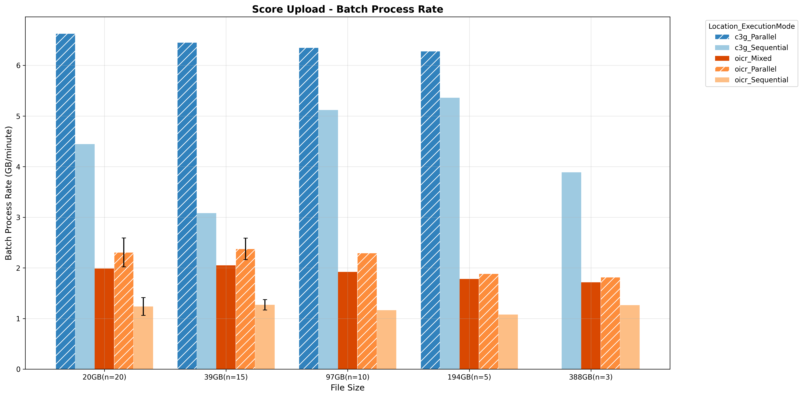
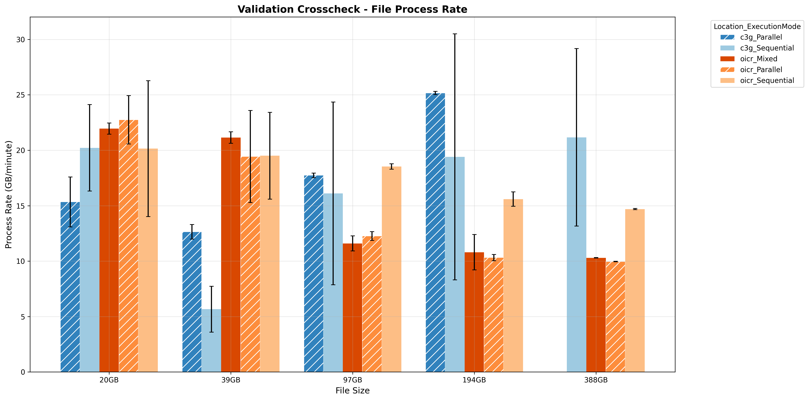
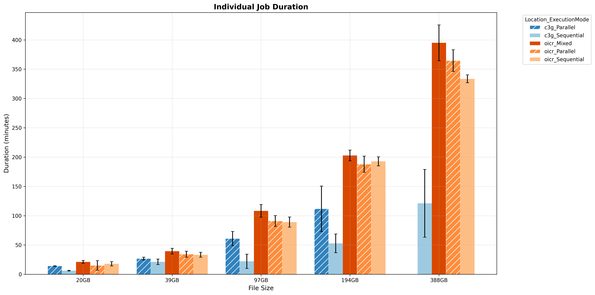
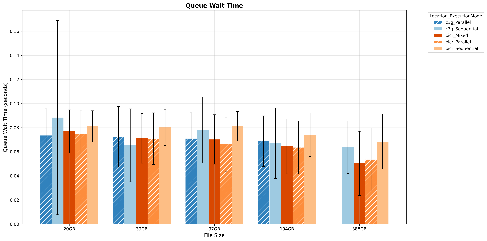

# PCGL Molecular Data Submission Workflow - Performance Analysis Results

## Executive Summary

This document presents the comprehensive performance analysis results for the PCGL molecular data submission workflow, conducted across two test environments (OICR and C3G) with varying file sizes (20GB to 388GB) and execution modes (Sequential, Parallel, Mixed). The analysis provides data-driven insights into workflow performance characteristics, resource utilization patterns, and infrastructure optimization opportunities.

**Key Highlights:**
- C3G demonstrates **~4.5x better data transfer throughput** compared to OICR for Score Upload operations
- Sequential execution shows **superior performance** for compute-intensive validation tasks
- **Near-zero queue wait times** indicate adequate resource provisioning across both infrastructures
- Batch-level metrics reveal consistent performance patterns across different file sizes

---

## Test Environment Configuration

### Testing Infrastructure

| Location | Submission Node Environment | Object Storage Co-location | Network Profile |
|----------|----------------------------|---------------------------|-----------------|
| **OICR** | OpenStack VMs | No | Standard network |
| **C3G** | HPC cluster | Yes | Premium network transfer |

### Test Data Matrix

| File Size | Batch Size | Total Data Volume | Execution Modes Tested |
|-----------|----------------------|-------------------|------------------------|
| 20GB | 20 | 400GB | Sequential, Parallel, Mixed |
| 39GB | 15 | 585GB | Sequential, Parallel, Mixed |
| 97GB | 10 | 970GB | Sequential, Parallel, Mixed |
| 194GB | 5 | 970GB | Sequential, Parallel, Mixed |
| 388GB | 3 | 1.16TB | Sequential, Parallel, Mixed |

### Execution Mode Definitions

- **Sequential**: Only one process is executed at a time (maxForks = 1)
- **Parallel**: Multiple processes are executed in parallel, limited by system resource availability
- **Mixed**: Combination of multiple parallel submission strategies to mimic concurrent load testing scenarios

---

## Performance Analysis Results

### 1. Score Upload Performance Metrics

#### 1.1 Batch-Level Metrics

Batch-level metrics measure the overall throughput for processing all files in a batch, calculated as:
- **Batch Duration** = max(complete_time) - min(start_time) across all tasks for the same workflow process
- **Batch Process Rate** = (file_size_gb × batch_size) / batch_duration_minutes

**Performance Summary:**

| Location | Sequential (GB/min) | Parallel (GB/min) | Mixed (GB/min) |
|----------|---------------------|-------------------|----------------|
| **OICR** | 1.1 - 1.3 | 1.8 - 2.5 | 1.8 - 2 |
| **C3G** | 3.1-5.4 | >6.2 |  |

#### 1.2 File-Level Metrics

File-level metrics aggregate the same task throughput across all submissions within the same location, execution mode, and file size combination. Process rate (GB/minute) is the primary metric, as it directly measures workflow efficiency.

**Performance Summary:**

| Location | Sequential (GB/min) | Parallel (GB/min) | Mixed (GB/min) |
|----------|---------------------|-------------------|----------------|
| **OICR** | 1.1 - 1.3 | ~1.2 | ~1.0  |
| **C3G** | 3.1-5.4 | 1.8-2.5 |  |

#### 1.3 Key Observations

**Batch-Level vs. File-Level Performance:**
- **Parallel mode achieves ~2x higher batch throughput** (OICR: ~2 GB/min, C3G: ~6.2 GB/min) compared to sequential mode
- **Individual file processing rates remain consistent** across execution modes for OICR (~1.0-1.2 GB/min), while C3G shows variability (1.8-5.4 GB/min)
- **Throughput gains in parallel mode stem from simultaneous execution**, not accelerated individual file transfers
- **Batch performance is constrained by infrastructure factors**: network bandwidth, submission node capacity (OpenStack VMs at OICR vs HPC cluster at C3G), and storage I/O limitations

**Cross-Location Performance:**
- **C3G demonstrates superior throughput due to its premium network transfer capabilities**: ~4.5x faster for file-level processing and ~3x faster for batch-level operations compared to OICR
- **OICR maintains stable performance**: Consistent rates at both file-level (~1 GB/min) and batch-level (~2 GB/min) across all file sizes and execution modes, reflecting the characteristics of VM-based submission nodes

**Execution Mode Impact:**
- **Parallel execution reduces total batch completion time** through concurrent task processing, making it beneficial for high-volume workloads
- **Individual file transfer rates are largely execution-mode independent** at OICR, indicating network I/O as the primary bottleneck in the OpenStack VM environment
- **Sequential vs. parallel trade-off**: While parallel mode improves batch throughput, it doesn't accelerate individual data transfers
- **Environment-specific recommendation**: For OpenStack VM-based submission nodes (OICR), use parallel execution for batch efficiency when processing multiple files, but expect similar per-file transfer rates regardless of execution mode; HPC cluster environments (C3G) may show more variability based on cluster load and network conditions

---

### 2. Validation Crosscheck Performance Metrics

#### 2.1 Batch-Level Metrics

#### 2.2 File-Level Metrics

#### 2.3 Key Observations
Validation tasks are driven by CPU/memory resources rather than network I/O, resulting in relatively consistent behavior between batch-level and file-level metrics. Performance patterns differ significantly between OpenStack VMs and HPC clusters, with VMs showing greater sensitivity to resource contention.

**OICR OpenStack VMs:**
- **Resource saturation under heavy load**: Batch-level and file-level throughput degrade significantly with larger file sizes when computational resources become constrained
- **Execution mode performance degradation**: Parallel and mixed modes experience notable performance loss with large files under resource-limited conditions, while sequential mode maintains more stable performance
- **Infrastructure bottleneck**: Compute-intensive validation operations show stronger resource constraints in the VM environment

**C3G HPC Cluster:**
- **Stable performance across workloads**: Batch-level throughput scales proportionally with batch size when computational resources are adequate
- **Resilient infrastructure**: HPC cluster maintains more consistent performance across varying file sizes and workload conditions compared to VM-based environment

---

### 3. Job Duration Performance Metrics

Job-level metrics analyze the complete execution time for processing individual genomic analysis files through the entire workflow pipeline.

**Performance Summary:**

| Location | File Size | Duration Range (min) |
|----------|-----------|---------------------|
| **OICR** | 20GB | 15 - 20 |
| **OICR** | 39GB | 30 - 40 |
| **OICR** | 97GB | 90 - 110 |
| **OICR** | 194GB | 184 - 205 |
| **OICR** | 388GB | 330 - 390 |
| **C3G** | 20GB | 5 - 15|
| **C3G** | 39GB | 20 - 30|
| **C3G** | 97GB | 25 - 60 |
| **C3G** | 194GB | 50 - 110 |
| **C3G** | 388GB | > 120|

**Key Observations:**
- **Individual job processing time scales with file size** across all configurations
- **C3G shows shorter durations** for larger files due to faster data transfer
- **Performance variability increases with file size**: Larger standard deviations observed for 194GB and 388GB files

---

### 4. Queue Wait Times

Resource contention analysis examines queue wait times to assess infrastructure resource availability and scheduling efficiency.

**Key Observations:**
- **Near-zero (~80ms) queue wait times** observed across both OICR and C3G infrastructures
- **Adequate resource provisioning** indicated by minimal scheduling delays
- **No significant resource contention** in current test scenarios
- **Both infrastructure** can handle additional concurrent workloads

---

